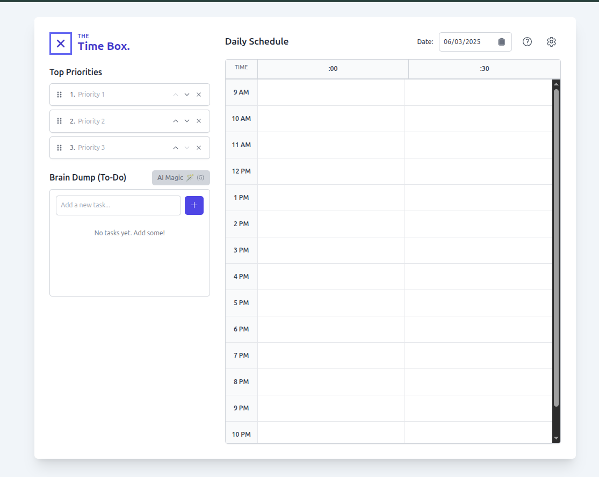

# The Time Box Planner

The Time Box Planner is a web application designed to help users manage their daily tasks and schedule using the **Time Boxing** methodology. It allows users to define top priorities, maintain a "brain dump" of tasks, and allocate these tasks to specific time slots in a daily schedule. The application also integrates AI (Google Gemini and OpenAI) to help refine task descriptions for enhanced clarity and motivation.

All data, including tasks, priorities, API keys, and settings, is stored locally in your browser's local storage.

---

**➡️ Live Demo:**  Comming Soon ! (Please , Run Locally to use it.)

---

## Screenshots


| Main Interface                      | AI Magic & Settings                |
| :----------------------------------: | :--------------------------------: |
|  |    |
| *Overview of the planner layout*    | *AI task refinement & settings*  |

| Mobile Responsive View             | Schedule & Priorities              |
| :----------------------------------: | :--------------------------------: |
|  |  |
| *Planner on a smaller screen*       | *Focus on schedule and priorities* |


*(Consider adding a GIF here showing key interactions, e.g., ``)*

---

## Project Goals & Motivation


*   To develop a practical application for personal productivity, exploring the Time Boxing technique.
*   To gain hands-on experience with React, TypeScript, Tailwind CSS, and modern frontend practices.
*   To integrate third-party APIs (Google Gemini and OpenAI) for AI-powered features.
*   To focus on creating a clean, intuitive, and aesthetically pleasing user interface.

---

## Key Features

*   **Daily Planning:** Select a specific date for planning.
*   **Top Priorities:** Define, edit, and reorder your top 3 daily goals.
*   **Brain Dump (To-Do List):**
    *   Add, edit, delete, and mark tasks as complete.
    *   Promote tasks from the brain dump to your Top Priorities list.
*   **AI Magic ✨:**
    *   Refine task descriptions for clarity, conciseness, and add a relevant emoji using either Google Gemini or OpenAI.
    *   One-time enhancement per task (to re-apply, delete and re-add).
    *   Customizable AI prompts: Edit, save, activate, and manage a history of AI prompts via a dedicated gallery.
*   **Daily Schedule:**
    *   Allocate tasks to 30-minute time slots throughout the day.
    *   Textareas auto-resize for easy input.
    *   Adjustable schedule display range (start and end times).
    *   Supports both 12-hour (AM/PM) and 24-hour time formats.
*   **Customization & Settings (⚙️ Icon):**
    *   **Themes:** Choose from multiple color themes (Default, Forest, Ocean, Sunset, Monochrome).
    *   **Time Display:** Select 12h or 24h format.
    *   **Schedule Range:** Define the visible hours in your schedule.
    *   **API Key Management:** Securely store your Google Gemini and OpenAI API keys in browser local storage.
    *   **AI Features Toggle:** Enable or disable all AI-powered features.
    *   **Preferred AI Service:** Choose between Gemini and OpenAI for the "AI Magic" feature.
    *   **AI Prompt Gallery:** Access and manage custom prompts for AI task refinement.
*   **Responsive Design:** Adapts to various screen sizes for use on desktop and mobile devices.
*   **Offline Capable (Core Features):** Core planning functionalities (priorities, brain dump, schedule) work without an internet connection if AI features are disabled or API keys are not provided.
*   **Welcome Guide:** A helpful introductory modal is shown to new users on their first visit.
*   **User Help Modal (? Icon):** Provides detailed instructions on how to use the application and an explanation of the Time Boxing method, including an embedded tutorial video.

---

## Tech Stack

*   **Frontend Framework:** React 19 (using ES Modules via esm.sh)
*   **Language:** TypeScript
*   **Styling:** Tailwind CSS
*   **AI Integration:**
    *   Google Gemini API (`@google/genai`)
    *   OpenAI API (`openai`)
*   **State Management:** React Context API
*   **Local Data Persistence:** Browser Local Storage
*   **Module Loading:** Native ES Modules in the browser (no build step required for development).

---

## Key Learnings & Challenges


*   **State Management with Context API:** Efficiently managing and propagating state for themes, settings, and application data across components.
*   **Dynamic UI Updates:** Ensuring components like the schedule and task lists re-render correctly based on user interactions and settings changes (e.g., time format, schedule range).
*   **Third-Party API Integration:** Handling asynchronous API calls for AI features, managing API keys securely on the client-side (local storage), and providing user feedback during processing.
*   **UI/UX Design:** Iteratively designing the interface for clarity, ease of use, and visual appeal, including features like drag-and-drop and responsive layouts.
*   **No-Build-Step Development:** Working directly with ES modules and understanding the implications for development and deployment.

---

## Getting Started / How to Run Locally

This project is set up to run directly in the browser without a complex build process.

### Prerequisites

*   A modern web browser (e.g., Chrome, Firefox, Edge, Safari).
*   A simple HTTP server to serve the files. Common options include:
    *   VS Code "Live Server" extension.
    *   `npx serve` (requires Node.js and npm/npx).
    *   Python's built-in HTTP server.

### Steps to Run

1.  **Clone the Repository:**
    ```bash
    git clone https://github.com/ramitdour/time-box-app.git 
    cd time-box-app
    ```

2.  **Serve the Application:**
    *   **Using VS Code Live Server:**
        1.  Open the project folder in VS Code.
        2.  Install the "Live Server" extension if you haven't already.
        3.  Right-click on `index.html` in the VS Code explorer and select "Open with Live Server."
    *   **Using `npx serve`:**
        1.  Make sure you have Node.js and npm installed.
        2.  In your terminal, navigate to the project's root directory.
        3.  Run the command:
            ```bash
            npx serve
            ```
        4.  It will typically serve the application at `http://localhost:3000` or a similar address.
    *   **Using Python's HTTP Server:**
        1.  Make sure you have Python installed.
        2.  In your terminal, navigate to the project's root directory.
        3.  Run the command:
            *   For Python 3: `python -m http.server`
            *   For Python 2: `python -m SimpleHTTPServer`
        4.  It will typically serve the application at `http://localhost:8000`.

3.  **Access in Browser:**
    Open the URL provided by your HTTP server (e.g., `http://localhost:3000`) in your web browser.

### API Key Configuration (for AI Features)

To use the "AI Magic" feature, you need to provide API keys for Google Gemini and/or OpenAI.

1.  **Obtain API Keys:**
    *   **Google Gemini:** Get your API key from [Google AI Studio](https://aistudio.google.com/app/apikey).
    *   **OpenAI:** Get your API key from the [OpenAI Platform](https://platform.openai.com/api-keys).

2.  **Enter Keys in Application Settings:**
    *   Once the application is running in your browser, click the **Settings icon (⚙️)**.
    *   Navigate to the "API Key Management" section.
    *   Enter your respective API keys into the input fields.
    *   These keys are stored **locally in your browser's local storage** and are not transmitted anywhere else by this application except directly to the respective AI service provider (Google or OpenAI) when you use the AI Magic feature.

    **Note on `process.env.API_KEY`:** The `@google/genai` SDK guidelines often refer to `process.env.API_KEY`. This typically applies to backend or Node.js environments where environment variables are loaded during a build process or server startup. In this purely client-side application, the `GoogleGenAI` client is initialized using the API key provided by the user and stored in local storage (retrieved via the `ThemeContext`).

---

## Future Enhancements

*   **Data Persistence per Date:** Implement a more robust way to save and load plans for different dates (e.g., using IndexedDB for more structured local storage or a backend service).
*   **Cloud Sync:** Option to sync data across devices using a backend service (e.g., Firebase).
*   **Task Reminders/Notifications:** Integrate browser notifications for upcoming time-boxed activities.
*   **Recurring Tasks:** Ability to set tasks that repeat daily or weekly.
*   **Analytics/Reporting:** Simple dashboard showing task completion rates or time spent on categories.
*   **Export/Import Data:** Allow users to backup their data or share plans.

---

## Application Structure

*   `index.html`: The main HTML file.
*   `index.tsx`: The entry point for the React application.
*   `App.tsx`: The main application component orchestrating different parts of the UI and logic.
*   `components/`: Contains all React components (e.g., `BrainDump.tsx`, `Schedule.tsx`, `SettingsModal.tsx`).
*   `ThemeContext.tsx`: Manages theme, schedule settings, AI preferences, and API keys using React Context.
*   `themes.ts`: Defines available color themes.
*   `types.ts`: Contains TypeScript type definitions.
*   `constants.ts`: Holds application-wide constants like default AI prompts.
*   `utils.ts`: Utility functions, e.g., for formatting time.
*   `metadata.json`: Application metadata for potential framework integration (not heavily used in this static setup but good practice).

---

## Contributing

Contributions are welcome! If you'd like to contribute, please fork the repository and submit a pull request. For major changes, please open an issue first to discuss what you would like to change.

## License

This project is open-source and available under the [MIT License](LICENSE.md). 
